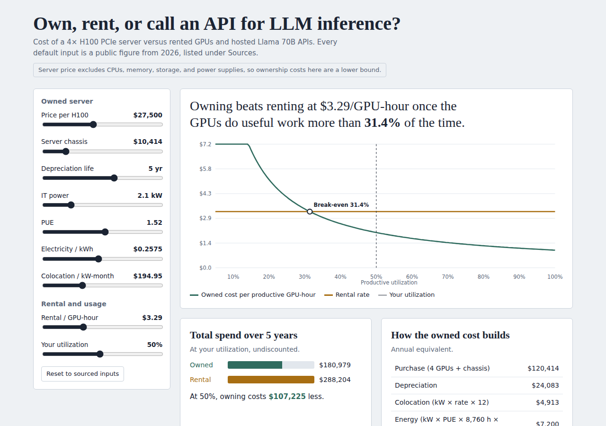

# Own, Rent, or API? An LLM Inference Cost Model

When does buying a 4× H100 server beat renting GPUs or calling a hosted Llama 70B API? This model solves for the break-even utilization of each option. The model combines public reference figures with simplifying assumptions: GPU and server listings, cloud and API price pages, a vLLM throughput benchmark, EIA electricity data, CBRE colocation rates, Uptime Institute PUE, and hyperscaler 10-K depreciation schedules.

**Interactive dashboard:** Download the repository and open `index.html` in a browser.



*Data as of September 2026. Prices move monthly.*

## Key findings

- **Owning beats renting at the Lambda PCIe list price ($3.29/hr) above ~31% utilization.** Against cheaper Runpod rates, the break-even rises to 36–52%.
- **Depreciation life moves the answer most.** Break-even is ~28% on a 6-year schedule (Microsoft, Alphabet), ~31% on 5 years (Amazon), and ~45% on the 3-year view critics argue for. GPU price, colocation, and electricity ranges each move it by less than 3 points.
- **The cheapest API is the toughest competitor.** For Llama 3.x 70B batch work, owning beats DeepInfra only above ~47% utilization. Under the modeled throughput and API-price assumptions, ownership does not break even against DeepInfra for interactive chat. Against Bedrock, Fireworks, and Together, owning wins above 7–23%.
- **These owned-cost figures are a lower bound.** The server price excludes CPUs, memory, storage, and power supplies, and the throughput benchmark ran on faster NVLink hardware. Both push real break-evens higher.

## Method

```
Capex               = 4 × GPU price + server chassis
Annual energy       = IT kW × PUE × 8,760 h × $/kWh
Annual colocation   = IT kW × $/kW-month × 12
Annual owned cost   = capex / life + colocation + energy
Break-even util     = annual owned cost / (4 × 8,760 × rental $/GPU-hr)

Requests/sec        = output tok/s / 256
Owned $ per 1K req  = annual owned cost / (requests/sec × 31,536,000 × utilization) × 1,000
API $ per 1K req    = (1,024 × input price + 256 × output price) / 1M × 1,000
```

| Base result | Value |
|---|---|
| Capex | $120,414 |
| Annual depreciation (5 yr) | $24,083 |
| Annual colocation | $4,913 |
| Annual energy | $7,200 |
| Annual owned cost | $36,196 |
| Break-even vs $3.29/hr rental | 31.4% |

## Inputs and sources

| Input | Default | Source |
|---|---|---|
| H100 80GB PCIe card | $27,500 | Midpoint of $25K–$30K range, [Runpod H100 guide](https://www.runpod.io/articles/guides/nvidia-h100), Sept 2026 |
| Server chassis | $10,414 | Dell R760xa barebone with 4-GPU kit, Newegg listing. **Excludes CPUs, memory, storage, power supplies** |
| IT power | 2.1 kW | 4 × 350 W H100 PCIe TDP (Runpod) + 2 × 350 W Xeon TDP (Dell R760xa spec, IT Creations). Rated maximums |
| PUE | 1.52 | [Uptime Institute survey discussion](https://intelligence.uptimeinstitute.com/resource/growing-pue-advantage-larger-data-centers) |
| Electricity | $0.2575/kWh | [EIA Electric Power Monthly](https://www.eia.gov/electricity/monthly/), California commercial, Apr 2026 (historical figure; retain the original table snapshot) |
| Colocation | $194.95/kW-month | [CBRE national average lease rate](https://www.cbre.com/press-releases/fast-growing-north-american-data-center-market-set-records-in-2025) (Silicon Valley: $180–$275) |
| Depreciation life | 5 years | [Amazon 2025 10-K](https://www.sec.gov/Archives/edgar/data/1018724/000101872426000004/amzn-20251231.htm): a subset of servers and networking equipment revised from 6 to 5 years. Six years is a sensitivity scenario |
| Rental rate | $3.29/GPU-hr | [Lambda H100 PCIe list price](https://lambda.ai/instances). Median across 38 providers: $3.36 (GetDeploying, Sept 16, 2026) |
| Throughput | 3,400 / 1,400 output tok/s | [GeneralCompute vLLM benchmark](https://www.generalcompute.com/blog/generalcompute-vs-vllm-throughput-latency-and-cost-benchmarks), Llama 3.1 70B FP8, 4× H100 SXM, Jun 2026 (batch at 256 concurrent; interactive at 64 users × ~22 tok/s) |
| API prices, Llama 3.3 70B | see table below | OpenRouter (DeepInfra), Aug 2026; Markaicode pricing guides (Bedrock, Fireworks, Together), Sept 2026 |
| Utilization | not assumed | The model solves for break-even |

## Break-even by rental price

| Provider | $/GPU-hr | Break-even |
|---|---|---|
| Runpod PCIe, community | 1.99 | 51.9% |
| Runpod PCIe, secure | 2.89 | 35.7% |
| Lambda PCIe | 3.29 | 31.4% |
| Median, 38 providers | 3.36 | 30.7% |
| Lambda (per CloudZero) | 3.99 | 25.9% |
| CoreWeave | 4.25 | 24.3% |
| Azure, high end | 6.98 | 14.8% |

Azure and SXM-based rates are not fully like-for-like with a PCIe server.

## Break-even across sourced input ranges

| Input changed | Value | Break-even |
|---|---|---|
| Base | | 31.4% |
| Depreciation life | 3 yr (critics) | 45.3% |
| Depreciation life | 6 yr (Microsoft, Alphabet) | 27.9% |
| H100 price | $25,000 / $30,000 | 29.7% / 33.1% |
| Colocation | $180 / $275 (Silicon Valley) | 31.1% / 33.1% |
| Electricity | $0.1351 (US commercial avg) | 28.4% |

## Self-host vs API

Cost per 1,000 requests of 1,024 input and 256 output tokens, Llama 3.x 70B.

| Option | $ per 1K req | Owning wins above (batch) | Owning wins above (interactive) |
|---|---|---|---|
| Owned server at 100% utilization | $0.086 (batch) / $0.210 (interactive) | | |
| Rented GPUs at $3.29/hr | $0.275 (batch) / $0.668 (interactive) | 31.4% | 31.4% |
| DeepInfra ($0.10 in / $0.32 out per 1M) | $0.184 | 46.9% | Never |
| AWS Bedrock ($0.72 per 1M) | $0.922 | 9.4% | 22.8% |
| Fireworks ($0.90 per 1M) | $1.152 | 7.5% | 18.2% |
| Together ($1.04 per 1M) | $1.331 | 6.5% | 15.8% |

## Source verification status

Links above identify the retrievable source pages. Exact original URLs or archived snapshots are still needed for the Newegg chassis listing, CPU specifications, historical API prices, and provider-median figure. Those inputs remain provisional; the cited pages do not independently validate every model default. Current prices may differ from the retained scenario inputs.

## Limitations

- The server price excludes CPUs, memory, storage, power supplies, networking, and installation.
- Throughput was measured on H100 SXM with NVLink; a PCIe server is likely slower.
- Power uses rated maximums, not measured draw.
- Excludes staff time, financing, taxes, resale value, failures, and spares.
- Uses list prices; reserved and negotiated rates are usually lower.
- Assumes quality parity between self-hosted and API versions of the same model.

## How to run

- **Dashboard:** open `index.html` in a browser.
- **Model:** `python gpu_tco_model.py`. This needs only the Python 3 standard library and writes CSVs to `data/`.

## Next steps

- Get a complete vendor quote for a configured 4× H100 PCIe server.
- Benchmark throughput on PCIe hardware.
- Run discovery interviews with infra teams ([`docs/interview-guide.md`](docs/interview-guide.md)) and add findings here.

## Repo structure

```
index.html               Interactive dashboard
gpu_tco_model.py         Model with source notes
data/                    Utilization, rate, input-range, and token-economics CSVs
docs/memo.md             Findings memo
docs/prd.md              Product requirements for the tool
docs/interview-guide.md  Discovery interview script
docs/screenshot.png      Dashboard screenshot
```

---
Built by [Mansi Shiroya](https://www.linkedin.com/in/themansishiroya/)
